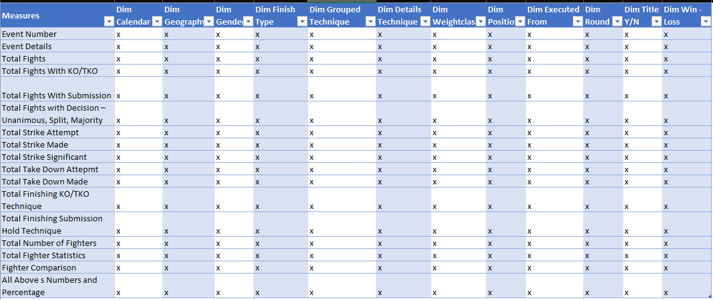

# UFC Power BI Report

## **Ultimate Fighting Championship Power BI Report**

---
**Document Author**                                                   
|Date |Author|Version|Role|                   
|:----|:-----|:------------|:----|                                        
|Nov/08/2023|Fatjan Paloja| 1.0| Power BI Consultant 
## Introduction

A few years ago I was introduced to the IKIGAI concept of people in Okinawa and as a follower of the philosophy "absorb what is useful, reject what is useless and create your own" 🙂, it seemed to me an interesting visual representation of the reflection of the connections between profession and passion.
Miyamoto Musashi (Author of Book of Five Rings) in one of his sayings says: "If you know the WAY broadly you will see it in everything" and being a passionate long-time practitioner of martial arts (hands and weapons) - the side of passion as well as profession Power BI Report Creator al Data Analyst - the passion side of the profession, I considered it as a combination - interesting connection between combat sports events, specifically UFC MMA Events in this case, as well as their analysis through the construction of a report in Power BI , where the results of the fights will be materialized in a way that tells the story in the best way.

Considering that there is more than one way to climb the mountain, for the moment, at this time, this is my way of the moment that I saw fit to build this report.
I say this because the possibilities of Power BI as a product are rapidly changing for the better, both superficially - in the visualization part as well as the content part, this makes us as creators try to keep up with the evolution of the product. Again from Musashi: "Determine that today you will overcome your self of the day before"
## Data
The data was collected from several sources, first from VEGAS ODDS (there were csv files that for some reason are no longer available), Wikipedia (they were extracted by web scrapping) as well as from the UFC official website (through webscraping in this case the photos of the female fighters ). The initial data from Vegas Odds is very dirty. With the use of Power Query I have prepared them for the data model. The initial purpose was that I considered these csvs to be open to the public and the project was originally built so that every week we download new files from Vegas Ods and the report is automatically updated. Also, the built data model follows a Header/Detail table approach, calculating the reusability of the data I had. This is no longer available because that site no longer hosts the data. The data I have available represents the real data on the events held in the UFC from March 11, 1994 to August 12, 2023, that is, almost 30 years, which are 7,128 fighting. According to my analysis of the data, these data are not all because some events are missing, something that can be seen if you compare the skills of any fighter from my report to the one on the Internet, but in any case, those that are available are super sufficient for the construction of a data model on which a report will be built analyzing events, events and fighters.
As an idea in the future, I have the completion of all events and events by building an application in PowerApps or in Google AppSheet for input data forms, but it also depends on how much time I have available, always for myself and my curiosity.
The way of completing this report has some inspirations (from other platforms) that have served as basic ideas for further construction while the navigation of the report is based on the inspiration from some reports that I have seen from Miguel Myers (from him I have seen two levels, I have expanded them up to three).
Due to the best use of the canvas, I used the tooltip and when I wanted to present details that I considered reasonable, I used the drillthrough ability in Power BI.

**_The purpose of this report is the reflection of my skills as a data analyst and Power bi Creator in my portfolio, as well as the research of the capacities of power bi in the presentation of data in the form of a report approximately as a web page. The data is not my property, and this presentation of the report has no commercial purpose, even though the data represents the real races that took place (with some events as mentioned that are missing)_**

## Statement

Prompt:
As a long-time martial artist and Power BI consultant, I wanted to build for myself a data model on the fights that take place in the UFC - MMA for my curiosity in order to analyze the results of the fights from which they come and which dominate. The possibilities for building a report in BI are numerous because there is abundant data, although not complete.
  
## BI Requirements

The requirements of the bi project were analyzing these metrics:
- Number of events
- Event details
- Total Fights
- Total Finishes with KO/TKO
- Total Finishes with Submission
- Total Fights with Decision – Unanimous, Split, Majority
- Total Strike Attempt
- Total Strike Made
- Total Strike Significant
- Total Take Down Attempt
- Total Take Down Made
- Total Finishes (KO/TKO + Submissions)
- Total Decision (Unanimous + Split + Majority)
- Total Fighters
- Attempted Strikes vs. Strikes Made
- Attempted Take Downs vs. Take Downs Made
- Submission Attempt vs Submission Made
- Significant Strikes
- Target Strikes
- Type of Finishing strike
- Type of Finishing Submission

All the above as numbers and as percentages.

All these metrics should be analyzed in these dimensions: 

- Dim Calendar
- Dim Geography
- Dim Gender
- Dim Finish Type
- Dim Grouped Technique
- Dim Technique Details
- Dim Weight Class
- Dim Position
- Dim Executed From
- Dim Rounds
- Dim Title YES/NO
- Dim Result (Win - Loss)

Bus Matrix :

[Test](https://github.com/Paloja2017/UFC-Public-Power-BI-Report/assets/92805638/256c036b-e1cc-47ed-852a-cbff95446393)

## Skills demonstrated

The project has been quite complex and challenging since the identification of the data that is complete, where I used Power Query to clean the data that was very dirty, web scraping on Wikipedia page and the UFC page as well as the use of GPT Chat for the needs during the progress of the project. Data modeling and DAX formulas where I used Tabular Editor 2 and 3 (especially C# macros).
Basic measurements as well as other measurements that are necessary and are presented specific to the project during the modeling process in a total of 225 complete measurements (counted in VertiPaq Analyzer) from functional measurements, measurements for automatic titles of visualizations, changes in color of visualizations, 4 columns added calculations and 3 calculation tables.
Most of the visualizations are native power bi visualizations, except for two that I used html content5 and Image Viz for the presentation of imagelinks as photos.
Tooltips were used intensively for the maximum use of the canvas, as well as for analyzing the details, I used the drillthrough where I wanted the details of the presentations, also in most of the visualizations, the drilldown is also present when I wanted to enter the dimensional hierarchy.
The navigation in the report is mainly two-level, but on some pages I have three levels without need, as can be seen when interacting with the report.

## Project Steps

- Identification of data sources
- Data extraction and purification:          
- Data residency in One Drive for Business
- Building the data model
- Building calculations and formulas in DAX
- Field Parameters
- Choice of navigation through the pages of the report
- The choice of visualizations that we consider suitable for showing the story
- The use of toltip for maximum use of the space of the canvas
- The use of drillthrough and drilldown for maximum use of the canvas space
- Refreshing them once a week - every Monday

## Report Navigation and Visualizations:

The report is multi paged and intended for ease of use. You have multi layered buttons on the top that you would use to navigate to different report pages
We are measuring five metrics: Number of events, Event details, Total Fights, Total Finishes with KO/TKO, Total Finishes with Submission, Total Fights with Decision – Unanimous, Split, Majority, Total Strike Attempt, Total Strike Made, Total Strike Significant, Total Take Down Attempt, Total Take Down Made, Total Finishes (KO/TKO + Submissions), Total Decision (Unanimous + Split + Majority), Total Fighters, Attempted Strikes vs. Strikes Made, Attempted Take Downs vs. Take Downs Made, Submission Attempt vs Submission Made, Significant Strikes, Target Strikes, Type of Finishing Strikes, Type of Finishing Submission. For the dominant color I have choose #8FD322. It is not in harmony with the UFC logo but I have liked the most.

- Created a new workspace named Fatjan Paloja Fabric_Test and selected a trial of Microsoft Fabric for 60 days.
   
   
 

- Created a lake house
   
   
 
- Data source
   
  Added new Data pipeline - TaxiDataPipeline_Directlake
   
   

- Loaded to Delta table data preview
   
   
  

- Linked a Pipeline to Outlook and Teams - on data refresh succes they sent a mesage you wrote beforehand, for example "Data is refreshed succesfully"
   
   
  
   
   
- On SQL Endpoint I created a View and added new date only column
   
   
  

- Model view of storage mode as Datalake
   
   
   
   
   

- Modeling
   
  Connected Power BI desktop to Onelake data hub - LakeHouses preview and loaded data as Direct Query over AS and for calendar table I used SqlBI Bravo tool which has builded for me Calendar Table with DAX (You can use a Calendar Table builded in Dataflow Gen2 also). I created relationship between Calendar Table and Taxi data on Date columns
   
   

- Measures, Calculated Table and Field Parameters
   
  I have used VertiPaq Analyzer to list the measures for showing here. The procedure is to open the DaxStudio in Power BI external tools, in advanced tab export metrics, then connect Vertipaq Analyzer with .vpax file.
   
   
  

## Visualizations:

  The report is single paged and intended for ease of use. We are measuring five metrics: Fare Amount, Average Trips Amount, Count of Trips, Tip Amount and Total Amount in single page - you can change the metrics in the slicer down right, also we have a slicer down left for selecting the years you want to analyze.
When you click a particular metrics slicer down right, that BAN number which is measured is highlighted. For the color I have choose #7B88BF to be in harmony with the fictional company logo.
   

  
     
 ## Analysis:
By analyzing seven years of data, we see that NYC Taxis Company had more than 153 milion trips in total
|Year|Trips_#|              
|:----------|:----------|
|2013   |2,421,622|
|2014  |31,674,002|
|2015  |38,467,530|
|2016  |32,771,064|
|2017  |23,481,028|
|2018  |17,613,798|
|2019   |6,595,934|
   
As we see from data the year 2015 has maximum trips compared to other years with 38,467,530 also maximum transaction per month was in May2015 with 
3,573,696 trips
  

 
By analyzing seven years of data, we see that NYC Taxis Company had more than 1.90 Bn fare amount in total
|Year|Fare Amount $|              
|:----------|:----------|
|2013   |$ 30,038,429.24|
|2014  |$ 395,246,914.90|
|2015  |$ 474,342,003.48|
|2016  |$ 397,734,160.50|
|2017  |$ 276,958,721,38|
|2018  |$ 236,515,106.90|
|2019  |$ 90,187,147.06|
   
As we see from data the year 2015 has maximum fare Amount compared to other years with $ 474,342,003.48 also maximum fare amount per month was in May2015 with $ 45,470,410.92 dollars
  

By analyzing seven years of data, we see that NYC Taxis Company has average of  $ 12.42  dollar per trip
|Year|Average Amount/Trip $|              
|:----------|:----------|
|2013   |$ 12.40|
|2014   |$ 12.48|
|2015   |$ 12.33|
|2016   |$ 12.14|
|2017   |$ 11.79|
|2018   |$ 13.43|
|2019   |$ 13.67|
   
As we see from data the year 2019 has greater average per trip compared to other years with $ 13.67 also maximum average per trip for year month was in Nov2018 with $ 14.42 dollars/Trip
  

By analyzing seven years of data, we see that NYC Taxis Company has in total $ 175.42 Milion dollar tips
|Year|Tips Amount $|              
|:----------|:----------|
|2013   |$ 2,138,815.32|
|2014   |$ 34,421,748,72|
|2015   |$ 46,718,194.34|
|2016   |$ 40,763,033.08|
|2017   |$ 26,995,782,82|
|2018   |$ 17,910,008.32|
|2019   |$ 6,476,652.96|
   
As we see from data the year 2015 has maximum Tips in dollars compared to other years with $ 46,718,194.34 also maximum ayear month was in May2015 with $ 4,572,791.96 dollars.
  

By analyzing seven years of data, we see that NYC Taxis Company has more than $ 2.26 Bilion dollar total sales
|Year|Tips Amount $|              
|:----------|:----------|
|2013   |$ 34,549,295.16|
|2014   |$ 460,439,902.70|
|2015   |$ 570,883,021.18|
|2016   |$ 479,806,112.60|
|2017   |$ 334,415,882.20|
|2018   |$ 277,432,216.26|
|2019   |$ 107,378,070.30|
   
As we see from data the year 2015 has maximum amount in dollars compared to other years with $ 570,883,021.18 also maximum year month was in May2015 with $ 54,499,244.10 dollars.
  

 
## Conclusion
  
As we see from the data, trips reached maximum in 2015 and from there we have a decline with every year that passes. We have to analyze also some other data from other data sources and getting more and deeper insights about Sales Taxi Company.
This project as I mentioned above was only to experiment with Microsoft Fabric also to showcase some of Power BI capabilities. 

