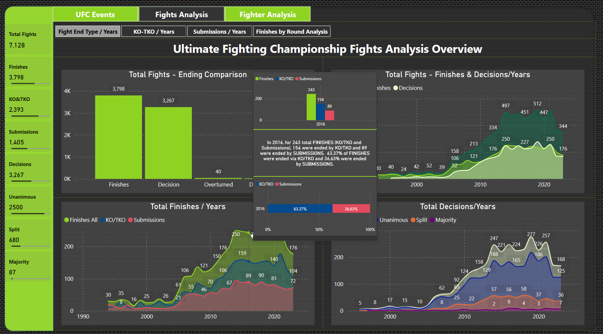

# UFC Events, Fights and Fighters Analysis

## **Ultimate Fighting Championship Power BI Report**

---
**Document Author**                                                   
|Date |Author|Version|Role| Client|                  
|:----|:-----|:------------|:----|:----|                                     
|Nov/08/2023|Fatjan Paloja Power BI Report Creator| 1.0| Power BI Consultant | Fatjan Paloja Martial Artist
## Introduction

A few years ago I was introduced to the IKIGAI concept of Okinawa people and as a follower of the philosophy "absorb what is useful, reject what is useless and create your own" 🙂, it seemed to me an interesting visual representation of the among others, profession and passion.
Miyamoto Musashi (Author of Book of Five Rings) in one of his sayings says: "If you know the WAY broadly you will see it in everything" and being a passionate long-time practitioner of martial arts (hands and weapons) - the side of passion / and Power BI Content Creator - the side of passion and profession, I considered it as an interesting combination between combat events, specifically UFC MMA Events in this case, as well as their analysis through the creation of a report in Power BI, where the results of the fights will be materialized in a way that tells the story in the best way.

Considering that there is more than one way to climb the mountain, for the moment, at this time, this is my way of the moment that I saw how to build this report.
I say this because the possibilities of Power BI as a product are rapidly changing for the better, both in surface - in the visualization part as well as the content part, this makes us as creators try to keep up with the evolution of the product. Again from Musashi: "Determine that today you will overcome your self of the day before"
## Data
The data was collected from several sources, first from VEGAS ODDS (there were csv files that for some reason are no longer available), Wikipedia (they were extracted by web scrapping) as well as from the UFC official website (through webscraping in this case the photos of the fighters ). The initial data from VEGAS ODDS was very unclean. With the use of Power Query I have prepared them for the data model. The initial purpose was that I considered these csv are open to the public and the project was originally built so that every week we download new files from VEGAS ODDS and the report is automatically updated. Also, the built data model follows a Header/Detail table approach, calculating on the reusability of the data I had. This is no longer available because that site no longer hosts the data. The data I have available represents the real data on the events held in the UFC from March 11 1994 to August 12 2023, that is almost 30 years, which are 7,128 fights. According to my analysis of the data, these data are not total fights because some events are missing, something that can be seen if you compare the fights of any fighter from my report to the one on the Internet, but in any case, those that are available are super sufficient for the construction of a data model on which a report will be built analyzing events, events and fighters.
As an idea in the future, I have the completion of all events and fights by building an application in PowerApps or in Google AppSheet for input data, but it also depends on how much time I have available.
The way of completing this report has some inspirations (from other platforms) that have served as basic ideas for further construction while the navigation of the report is based on the inspiration from some reports that I have seen from Miguel Myers (from him I have seen two levels navigation buttons, I have expanded them up to three).
Due to the best use of the canvas, I used the tooltips and when I wanted to present details that I considered reasonable, and also I used the drillthrough and drilldown ability in Power BI visuals.

**_The purpose of this report is the presentation of my skills as a Data Analyst and Power BI Creator, as well as the reflection of the capacities of Power BI as BI software platform. The data is not my property, and this presentation of the report has no commercial purpose, even though the data represents the real fghts that took place (with some events as mentioned that are missing)_**

## Statement
As a long-time martial artist and Power BI Report Creator, I wanted to build for myself a data model on the fights that took place in the UFC - MMA for my curiosity in order to analyze the results of the fights why they end in certain way and which type of fighter dominate. The possibilities for building a report in BI are numerous because there is abundant data, although not complete.
  
## BI Requirements

The requirements of the BI project were analyzing these metrics:
- Number of events
- Event details
- Total Fights
- Total Finishes with KO/TKO
- Total Finishes with Submission
- Total Fights with Decision – Unanimous, Split, Majority
- Total Strike Attempt
- Total Strike Made
- Total Strike Significant
- Total Take Down Attempt
- Total Take Down Made
- Total Finishes (KO/TKO + Submissions)
- Total Decision (Unanimous + Split + Majority)
- Total Fighters
- Attempted Strikes vs. Strikes Made
- Attempted Take Downs vs. Take Downs Made
- Submission Attempt vs Submission Made
- Significant Strikes
- Target Strikes
- Type of Finishing strike
- Type of Finishing Submission

All the above as values and as percentages.

All these metrics should be analyzed in these dimensions: 

- Dim Calendar
- Dim Geography
- Dim Gender
- Dim Finish Type
- Dim Grouped Technique
- Dim Technique Details
- Dim Weight Class
- Dim Position
- Dim Executed From
- Dim Rounds
- Dim Title YES/NO
- Dim Result (Win - Loss)

## Skills demonstrated

The project has been quite complex and challenging from the start, the identification of the more detailed data sources was not easy, I had to took from different places, connect them together and clean using Power Query. I have used Web scraping on some sources and Chat GPT as well by the need during the progress of the project. For Data modeling and DAX formulas mostly I used Tabular Editor 2 and 3 (especially C# macros).
Basic measures and other measurements that are necessary to project during the modeling process are in a total of 225 complete measurements (counted in VertiPaq Analyzer) from functional measurements, measurements for automatic titles of visualizations, color changes of visualizations, 4 Calculated columns and 3 calculated tables.
Most of the visualizations are native power bi visualizations, except for two that I used HTML CONTENT 5 and IMAGE VIZ for the presentation of imagelinks as photos.
Tooltips were used intensively for the maximum use of the canvas, as well as for analyzing the details, I used the drillthrough where I wanted details of the presentations, also in most of the visualizations, the drilldown is also present when I wanted to enter the dimensional hierarchy.
The navigation in the report is mainly two-level, but on some pages I have expanded to three levels when I saw reasonable, as can be seen when interacting with the report.

## Project Steps

- Identify the user need, goals and concerns
- Identify possibilities
- Map your activity
- Identification of data sources
- Data residency
- Version control
- Data extraction and purification:          
- Building the data model
- Building calculations and formulas in DAX
- Field Parameters
- Choice of navigation through the pages of the report
- The choice of visualizations that we consider suitable for showing the story
- The use of toltip for maximum use of the space of the canvas
- The use of drillthrough and drilldown for maximum use of the canvas space
- Refreshing once a week - every Monday

## Report Navigation and Visualizations

The report is multi paged and intended for ease of use. You have multi layered buttons on the top that you use to navigate to different report page content.
We are measuring these metrics: Number of events, Event details, Total Fights, Total Finishes with KO/TKO, Total Finishes with Submission, Total Fights with Decision – Unanimous, Split, Majority, Total Strike Attempt, Total Strike Made, Total Strike Significant, Total Take Down Attempt, Total Take Down Made, Total Finishes (KO/TKO + Submissions), Total Decision (Unanimous + Split + Majority), Total Fighters, Attempted Strikes vs. Strikes Made, Attempted Take Downs vs. Take Downs Made, Submission Attempt vs Submission Made, Significant Strikes, Target Strikes, Type of Finishing Strikes, Type of Finishing Submission. For the dominant color I have choose #8FD322. It is not in harmony with the events but I have liked it the most.

## Report Content
### UFC Events/Country
Contains total events and fights analysis by year, continent, country, weightclass, fight end type (finishes, finishes details, decision, decision details)
  
 
 

 
 

### UFC Events/Years
Contains total events, fights, strike attempt vs strike landing, take down attempt vs take down made, finishes vs decisions, KO/TKO vs Submissions analysis by year, continent, country, weightclass, gender, fight end type.  

 

### UFC Events/Details
Contains total list of events, fights by gender, fights by age group which maximum is age group of 30 years with 1247 fighters who fought in UFC, in table when you hover with cursor it opens a tooltip where you find additional inormation about event description, event date and event image.  

 

### UFC Events/Fights Details Drillthrough
When you click with right button of mouse in prior page UFC Event/Details it gives you an option to drillthrough to detailed list of fights of that event. Also here (In tooltip) when you hover with cursor you have additional info about who is winner, who is loser, winning technique, fight time format, weightclass,round time fight finish, position.  

 

### UFC Events/Specific Fight Details Drillthrough
When you land in UFC Events/Fights Details Drillthrough it gives you an option to drillthrough to specified fight of that event. Also here when you hover with cursor you have additional info about strike attemptes vs Strike made, Significant strike attempted vs significant strike made, strike target - head, body, leg and strikes position distance, clinch, ground.

 

### Fights Analysis/ End Type/ Years
Contains types of fight ends - Finishes (KO/TKO & Submission), Decisions, Overturned and Disqualifications over the years. Also here when you hover your cursor you can see additional and more detailed information for that particular year (tooltips and drilldown).

 

### Fights Analysis / KO/TKO Overview
Contains KO/TKO finishes over the years and technique of that end fight over the years. When you hover over the visual you can find additional and more detailed information about that specific technique. Also you can drilldown to visual for more detailed information.

 

### Fights Analysis / KO/TKO Details
Contain decomposition tree visual in which you can clearly see main technique of KO/TKO, you can drillthrough here to go to a detailed list of fight who ended with that particular technique

 

Drillthrough to Finishing Technique example (Punches to Head)

 

### Fights Analysis / Technique Details /Years
Contains scatter chart who presents trends of the end technique over the years, in x axis cumulative wins and in y axis wins of that particular year

 

### Fights Analysis / Submissions Overview
Contains Submission finishes over the years and technique of that end fight over the years. When you hover over the visual you can find additional and more detailed information about that specific technique detail (tooltips). Also you can drilldown to visual for additional information.

 

### Fights Analysis / Submissions Details
Contain decomposition tree visual in which you can clearly see main technique of Submission, you can drillthrough here to go to a detailed list of fight who ended with particular technique

 

Drillthrough to Finishing technique ( Rear Naked Choke)

### Fights Analysis / Submissions Details / Years
Contains scatter chart who presents trends of end technique over the years, in x axis cumulative wins and in y axis wins of that particular year.

 

### Fights Analysis / Finishes by Round
Contains analysis of finishes (KO/TKO and Submission) over the rounds of bout.

 

### Fights Analysis / Finishes by Round Details
Contain decomposition tree visual in which you can clearly see end fights by rounds, you can drillthrough here to go to a detailed list of fight who ended with selected round.

 

### Fights Analysis / TopN Techniques by Round
Contains top trendy techniques 1,3,5,7,9,12 in values and percentages. You can filter them by years, round, gender, weightclass.

 

### Fighter Analysis / Fighters Country
Contains detailed list of fighters sorted by z - a who has the most fights in career also bar chart with top 12 countries with most fighters. Also in tooltip you can find for a fighter a ton of information about win rate, los rate, strikes accuracy, submissions accuracy, takedowns accuracy, average strikes per round, average takedowns per round, status, first and last debut, last fight age, height, weight, reach, weight division.

 

### Fighter Analysis / Fighters Stats
Contains analysis of particular fighter just select the filters then you will see total fights, wins, losess in total, by years, by end technique using drill down, by rounds also you can go deeper using drillthrough and drilldown to filtered total fights, wins or losses.

 

### Fighter Analysis / Fighters Comparison
Contains the stats of two fighters which can be selected from green filters below. These two filters filters only their side of fighter and the red filters filters all page. You can use this page report to compare two fighters and their performance.

 

### Report Interaction Link

[Report Interaction](https://app.powerbi.com/view?r=eyJrIjoiNDFkYjQ1MWEtODAwZS00ZDhkLTliMTgtMDQ0NDMyYzI1MDc4IiwidCI6ImIzMDFhNzU5LTgzNmUtNDY4OS1iMzg5LThjMWU0ZTc1NWRjZCIsImMiOjl9&pageName=ReportSection99f5c648835745ec5eb7)

 
## Conclusion
  
As we see from the data, we have analysed 646 events with 7,128 fights and different metrics to many dimension. I believe the report shows clear results and it is easy to navigate and understand who has the most advantage in particular years and which techniques dominate. In striking "Department" KO/TKO, Punches is the champion who has finishes rate of 70.25% ( To Head 97.68%, To Body 2.32%) and in Submission "Department", Choke is the champion who has Finishes rate of 77.92% (Rear naked Choke 49.45%, Guillotine Choke 23.13%, Arm Triangle Choke 9.05%...). We can see also that most fights end in Round 1 which 64.21% you have chance to knock out someone or get knocked out, 35.79% you have chance to submit someone or get sumbited...
This project as I mentioned above was to experiment with Microsoft Power BI also to showcase my capabilities as a content creator for my portfolio.

